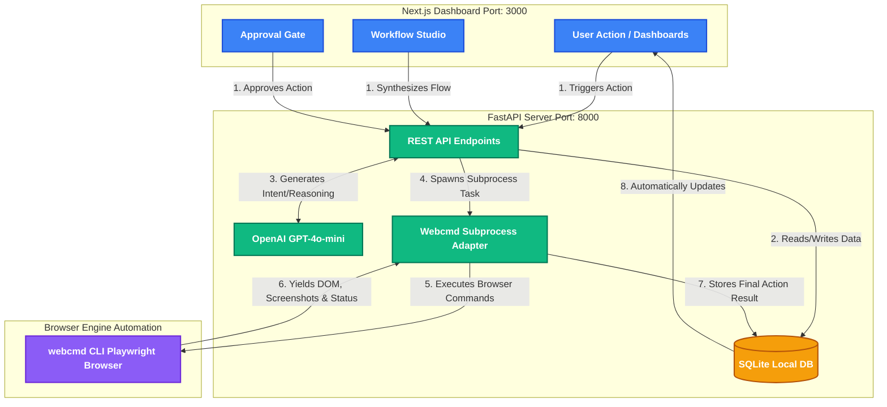

# Scout: Frontend and Backend Architecture

This document breaks down the Scout application into its core components (Frontend and Backend) and explains how they communicate to execute autonomous web tasks. 

---

## 🎨 Frontend (Next.js 16)

The frontend is a modern web application built with **Next.js 16 (App Router)** and styled using Tailwind CSS and Vanilla CSS. It provides the visual interfaces to interact with the backend AI agents.

### Core Portals
1. **Radar Dashboard (`/`)**: Displays the live feed of opportunities, metrics, and allows you to "Run Radar Now" to pull fresh data from the internet.
2. **Workflow Studio (`/workflows`)**: A visual node-based orchestrator allowing you to chain browser actions like `scroll`, `click`, `extract_text`, and `screenshot`.
3. **Approval Gate (`/approvals`)**: A human-in-the-loop safety gate where any automated "write" actions (e.g., submitting a form) wait for your 1-click confirmation before executing in the browser. 

The frontend uses standard `fetch` API methods natively bridging over to the local FastAPI backend (Next.js automatically rewrites `/api/*` to `http://localhost:8000/api/*`).

---

## ⚙️ Backend (FastAPI + Python 3.12)

The backend is built on **FastAPI** and orchestrates the heavy lifting — it manages databases, communicates with the OpenAI API, and spawns the browser processes.

### Core Modules
1. **FastAPI Routes (`/api`)**: Endpoints for handling pipelines, approvals, storing profiles, and parsing opportunities.
2. **Intelligence Engine (`gpt-4o-mini`)**: Dynamically extracts constraints from natural language workflows ("Find me cheap hotels") and synthesizes reasoning for web forms.
3. **Webcmd Subprocess Adapter**: This is the heart of the engine! To perform real-world browsing, the backend triggers the `@agentrhq/webcmd` CLI utilizing asynchronous Windows subprocesses. 
4. **SQLite Persistence Layer**: Uses `aiosqlite` and `sqlalchemy` to cache radar findings, generated AI schemas, user identity profiles, and workflows.

---

## 🔄 System Flowchart

Below is the Mermaid flowchart visualizing how data flows from your click on the frontend through the backend and into the stealth browser.

## Step-by-Step Working Example
If you click **"Run Radar Now"** on the Frontend:
1. The Next.js frontend sends a `POST /api/pipeline/run` request containing your intent to the FastAPI server.
2. The server connects to the database to evaluate existing targets via the `SQLite Local DB`.
3. The server uses `OpenAI GPT-4o-mini` to translate your intent ("Find AI hackathons") into specific, actionable browser criteria.
4. The **Webcmd Subprocess Adapter** spawns a background asyncio process that invokes the `webcmd` CLI.
5. The `webcmd CLI Playwright Browser` silently launches, navigates web pages, crawls through information, takes screenshots, and returns extracted JSON data.
6. The backend saves the extracted opportunities in the local database and the frontend updates to show you the new results!
